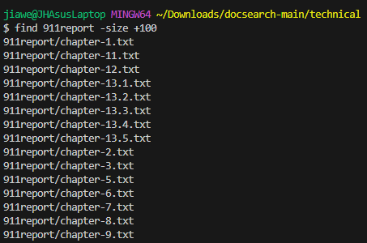
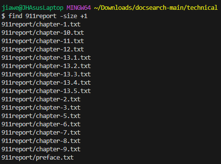
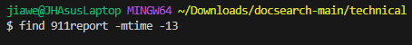
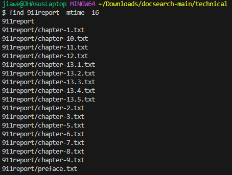

Part 1
=========


* A failure-inducing input for the buggy program, as a JUnit test and any associated code (write it as a code block in Markdown)


```
@Test
  public void test1() {
    int[] input1 = {3,3,3,1};
    assertArrayEquals(new int[]{1,3,3,3}, ArrayExamples.reversed(input1));
  }
}
```


* An input that doesn’t induce a failure, as a JUnit test and any associated code (write it as a code block in Markdown)


```
@Test
  public void testReversed() {
    int[] input1 = { };
    assertArrayEquals(new int[]{ }, ArrayExamples.reversed(input1));
  }
```


* The symptom, as the output of running the tests (provide it as a screenshot of running JUnit with at least the two inputs above)


* The bug, as the before-and-after code change required to fix it (as two code blocks in Markdown)


```
static int[] reversed(int[] arr) {
  int[] newArray = new int[arr.length];
  for(int i = 0; i < arr.length; i += 1) {
    arr[i] = newArray[arr.length - i - 1];
  }
  return arr;
}
```


```
static int[] reversed(int[] arr) {
  int[] newArray = new int[arr.length];
  for(int i = 0; i < arr.length; i += 1) {
    arr[i] = newArray[arr.length - i - 1];
  }
  return newArray;
}
```


* Briefly describe why the fix addresses the issue.


The bug was that elements were being changed/added in arr from newArray and not vice versa, it also returned the old array, not newArray


Part 2
=========


**Command: Find** 


**First Example**


`find -name <files>`


**1:**


**2:**


**Second Example**


`find -type f -name <files>`


**1:**


**2:**


**Third Example**


`find . -type f -name <files>`


**1:**





**2:**





**Fourth Example**


`find -type d -name <directory>`


**1:**





**2:**




